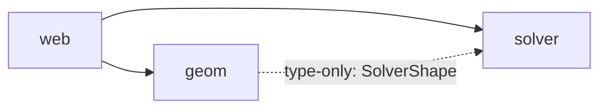

# crosssection

In-browser calculator for 2D cross-section properties: **Iₓ**, **Iᵧ** (second moments of area) and **J** (St. Venant torsional constant). Static, local-only SPA; the heavy lifting is `sectionproperties` (Python) running in Pyodide.

## Status

- **Core compute + CLI test battery**: working. `./test.sh` runs five preset shapes through the Pyodide solver; expected values cite external references (closed forms, Roark, Timoshenko & Goodier) — no self-computed regression baselines.
- **Browser UI** (`web/`): direct-manipulation editor with rod/rectangle/extrusion presets, Paint/Erase/Add-Hole tools, snap-to-grid, and an animated zero-state landing that hides Pyodide boot time behind a closed-form-numbers carousel. Three readouts (Iₓ, Iᵧ, J) update on every edit. Editor mental model + op trichotomy: see [`editor-model.md`](editor-model.md).

## Layout

Three self-contained modules. Each owns its own `package.json` and tests; per-module READMEs cover internals.

- **`solver/`** — Pyodide+sectionproperties FEM kernel. Browser entry is `SolverClient` (Web Worker RPC); Node entry is `compute()`. Includes the cytriangle wheel-build recipe.
- **`geom/`** — Pure, immutable geometry kernel for the editor. No DOM, no Pyodide. `apply(shape, op)` is the only mutation surface.
- **`web/`** — Browser UI, Vite-bundled. Composes `solver` + `geom`. Deletable without breaking the rest.



## Architecture notes

- Compute runs in Pyodide using [`sectionproperties`](https://github.com/robbievanleeuwen/section-properties) (Robbie van Leeuwen) plus [`cytriangle`](https://github.com/m-clare/cytriangle) (Cython wrapper around Shewchuk's [Triangle](https://www.cs.cmu.edu/~quake/triangle.html)). cytriangle has no Pyodide wheel on PyPI; we build one and commit it under `solver/wheels/`. See `solver/pyodide-build/cytriangle/README.md`.
- Tests run under Pyodide-on-Node, not in a browser — same Python, same wheels, same numerics. Every expected value cites an external source; self-computed regression baselines are not allowed.
- The web editor talks to `geom/` through `apply(shape, op) → ok | warn | err | invalid`; the editor never mutates shape state directly. The split exists so geometry decisions are unit-testable without a canvas — see [`editor-model.md`](editor-model.md).

## Dev instructions

### Test

```bash
(cd solver && npm install)
(cd geom && npm install)
./test.sh                            # full battery, 5 cases × 3 properties = 15 PASS, ~20s wall
(cd solver && npm run typecheck)
(cd geom && npm run typecheck)
```

`./test.sh` is the **canonical correctness gate**; the browser is a presentation layer over the same code.

### Run the browser UI

```bash
cd web
npm install
npm run dev         # vite dev server at http://localhost:5173/
```

On first load, a muted carousel of demo cross-sections plays in the canvas while Pyodide boots. Click **Rod / Rectangle / Extrusion** in the left pane to enter the editor; a small W/H/S/D form appears over the canvas — type values, Enter confirms. Use **Paint Rect / Erase Rect / Add Hole** in the toolbar to compose; **Space** toggles snap-to-grid. Right-click a vertex to delete it; click an empty edge handle to insert one. The status strip below the canvas surfaces tool hints, amber warnings, and red errors. The three readouts update after every edit; "computing…" fade indicates a solve in flight.

### Build the browser UI

```bash
cd web
npm run build       # static bundle in web/dist/
npm run preview     # serve dist/ for sanity check
```

### Deploy

`web/dist/` is plain static files — drop on any static host (Netlify/Pages/S3). The first page load fetches Pyodide's runtime (~5 MB) from the jsdelivr CDN.

### Rebuild the cytriangle wheel

Only needed when bumping cytriangle or Pyodide upstream:

```bash
solver/pyodide-build/setup-toolchain.sh   # one-time, ~2 GB for emsdk + xbuildenv
solver/pyodide-build/cytriangle/build.sh  # rebuild; stages into solver/wheels/
```

See [`solver/pyodide-build/cytriangle/README.md`](solver/pyodide-build/cytriangle/README.md) for the patches applied and what to do when upgrading.
